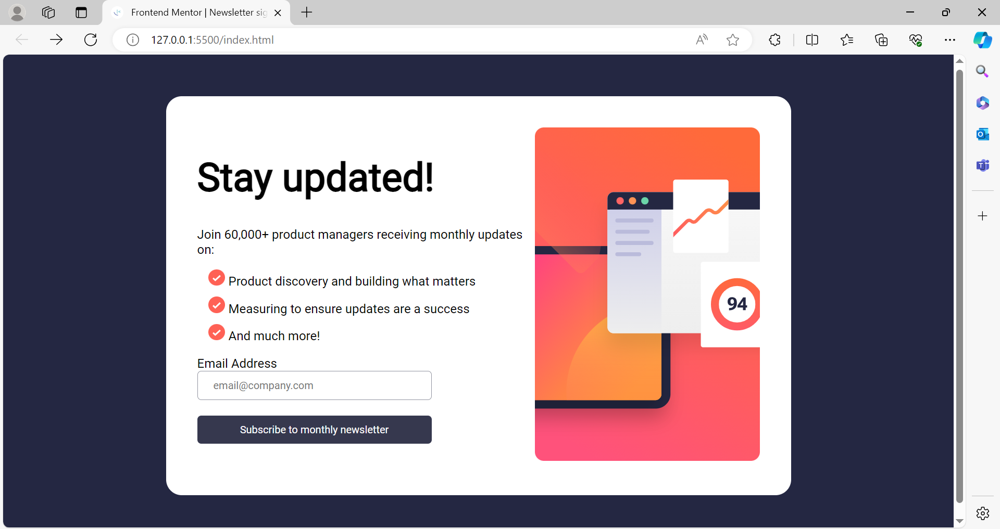

# Frontend Mentor - Newsletter sign-up form with success message solution

This repository contains a solution to the [Newsletter sign-up form with success message challenge on Frontend Mentor](https://www.frontendmentor.io/challenges/newsletter-signup-form-with-success-message-3FC1AZbNrv). Frontend Mentor challenges are designed to help developers improve their coding skills by building realistic projects.

## Table of Contents

- [Overview](#overview)
  - [The Challenge](#the-challenge)
  - [Screenshot](#screenshot)
  - [Links](#links)
- [My Process](#my-process)
  - [Built With](#built-with)
  - [What I Learned](#what-i-learned)
  - [Continued Development](#continued-development)
  - [Useful Resources](#useful-resources)
- [Author](#author)
- [Acknowledgments](#acknowledgments)

## Overview

### The Challenge

This project aimed to create a newsletter sign-up form with a success message, along with form validation messages for empty fields and incorrectly formatted email addresses. Additionally, the layout needed to be responsive for various screen sizes, and interactive elements were expected to have hover and focus states.

Your users should be able to:

- Add their email and submit the form
- See a success message with their email after successfully submitting the form
- See form validation messages if:
  - The field is left empty
  - The email address is not formatted correctly
- View the optimal layout for the interface depending on their device's screen size
- See hover and focus states for all interactive elements on the page

### Screenshot



### Links

- Solution URL: [Add solution URL here](AbigailAbenaDadzie.github.io)
- Live Site URL: [Add live site URL here](https://abigailabenadadzie.github.io/Newsletter-Sign-Up/)

## My Process
### Built With

Semantic HTML5 Markup: Semantic HTML5 elements provide meaning to the content they contain, making it more understandable for both developers and assistive technologies like screen readers. It improves accessibility and SEO.

CSS Custom Properties: CSS custom properties, also known as CSS variables, allow for the creation of reusable values throughout a CSS file. They enhance maintainability and flexibility in styling.

Flexbox: Flexbox is a layout model in CSS that allows for the creation of flexible and efficient layouts. It simplifies the alignment and distribution of elements within a container, making it ideal for responsive designs.

CSS Grid: CSS Grid is another layout model in CSS that enables the creation of complex grid-based layouts with rows and columns. It provides precise control over the placement and sizing of elements within the grid.

Mobile-first Workflow: Mobile-first workflow is a development approach where the initial focus is on designing and implementing the mobile version of a website or application before scaling up to larger screen sizes. It ensures a better user experience on mobile devices and simplifies the process of creating responsive designs.

React.js - JS Library: React.js is a JavaScript library for building user interfaces. It allows developers to create reusable UI components and manage the state of an application efficiently. React's component-based architecture simplifies the development process and promotes code reusability.

Next.js - React Framework: Next.js is a React framework that provides features such as server-side rendering, static site generation, and routing out of the box. It simplifies the development of React applications by offering built-in solutions for common tasks and optimizations for performance.

Styled Components - For Styles: Styled Components is a library for styling React components using tagged template literals. It allows developers to write CSS in JavaScript, enabling the creation of highly maintainable and scoped styles for individual components

### What I Learned

During this project, I gained experience in implementing form validation messages and ensuring responsiveness across different devices. Here are some snippets of what I learned:

```html
<div class="card-2 hide">
      
      <h1>Thanks for subscribing!</h1>
      <p>
        A confirmation email has been sent to <span id="emailText" class="email">ash@loremcompany.com</span>. Please open
        it and click the button inside to confirm your subscription.
      </p>
      <button>Dismiss message</button>
    </div>
  </div>
```
```css
@media (max-width: 768px) {
.card {
    flex-direction: column-reverse;
    width: 95%;
    padding: 0;
  }
  body {
    padding: 0;
    margin: 0;
  }
  .card h1 {
    font-size: 30px;
  }
  .right {
    width: 100%;
    padding: 20px;
  }
  .left {
    width: 100%;
  }
  .left img {
    content: url("./assets/images/illustration-sign-up-mobile.svg");
  }
  form {
    width: 90%;
  }
  .card-2 {
    min-height: 100vh;
  }
}
```
```js
console.log(validPattern);
  if (!emailValue || !validPattern) {
    errorMessage.innerText = "Valid email required";
    emailText.innerHTML = email.value;
    email.style.color = "red";
    email.style.border = "1px solid red";}
```

### Continued Development

In future projects, I plan to continue focusing on refining my skills in responsive design and improving my understanding of form validation techniques.

### Useful Resources

- [README.md](https://www.frontendmentor.io/community) - This resource helped me understand the requirement of the challenge and how to go about it.
- [style-guide.md](https://www.frontendmentor.io/community) - This resource also gave me some headson for styling of the form.

## Author

- Website - [Add your name here](AbigailAbenaDadzie.github.io)
- Frontend Mentor - [@yourusername](https://www.frontendmentor.io/profile/yourusername)


## Acknowledgments

I'd like to acknowledge Jerome for his support during this project.
